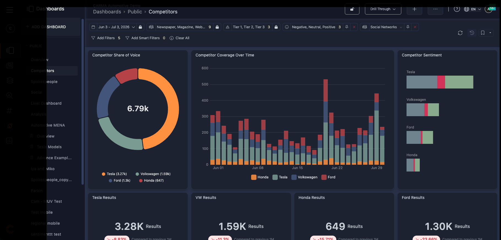
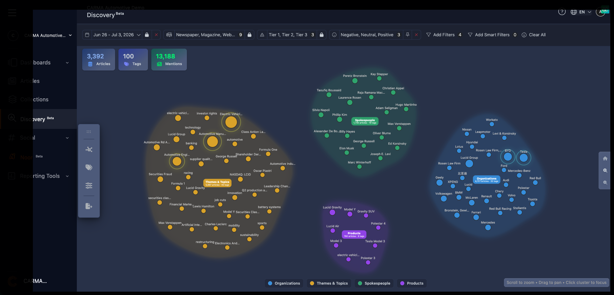

# CARMA — Media Intelligence Dashboards (Insight Portal)

> Internal dashboards for CARMA media intelligence platform. Media monitoring + PR measurement across online, print, broadcast, social, in 105+ languages. Portal: Insight at `insight.carma.com`. 3,500 orgs, 50 countries.

## Links

- Site: [https://carma.com/](https://carma.com/)
- Portal (login): [https://insight.carma.com](https://insight.carma.com)
- Software: [https://carma.com/products-and-services/software/](https://carma.com/products-and-services/software/)
- Help / dashboards guide: [https://help.carma.com/analytics-overview-basic-navigation](https://help.carma.com/analytics-overview-basic-navigation)

## What it is

- **Monitor**: online news / wires / paywalled, print, broadcast / podcasts / YouTube, social (X, Facebook, Instagram, TikTok, LinkedIn, etc.), blogs / forums, LLM visibility. Search with filters, list / kanban / table views, saved searches.
- **Analyse dashboards**: Analytics Overview (customizable), Power Dashboards with query builder, social dashboards, KPI widgets with trend comparison, sentiment / reach / share-of-voice charts.
- **Dashboard interactions**: global date + filter bar, drag / resize widgets, switch chart types, export to Excel / PowerPoint / PDF, fullscreen present mode, public vs. private vs. shared dashboards.
- **AI + reporting**: Noor AI analyst (plain-language Q&A over project coverage, charts, briefings), newsletters, alerts (WhatsApp / Telegram / Email / SMS), executive reports.
- **Platform**: multi-language portal (EN default, AR, PT), customizable homepage + favourite dashboards, rebuilt mobile app with real-time alerts + interactive dashboards.

## Frontend developer role

- Built / maintained internal Insight dashboards: widget layouts, chart rendering, filter bars.
- Implemented dashboard customization: drag-reposition, resize, chart-type switch, public / private sharing.
- Wired KPI / analytics widgets with date ranges, comparison periods, variance display.
- Built coverage search / filter UI across channels, languages, sentiment, social networks.
- Handled export / present flows and portal chrome (homepage prefs, language toggle, nav).
- Kept dashboards usable under real media scale (multi-market, high-volume coverage).

## Tech signals

- Dashboard-heavy Reactjs SPA: widgets, charts, query builder, filter state.
- Nodejs.

## Screenshots

