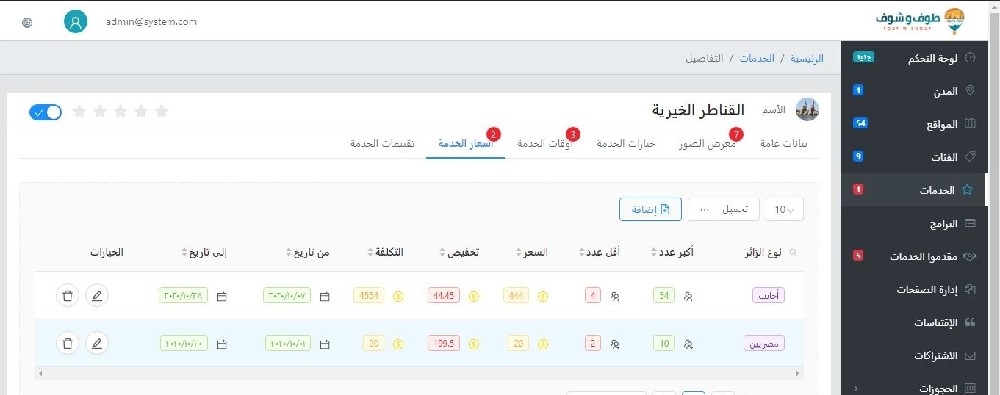
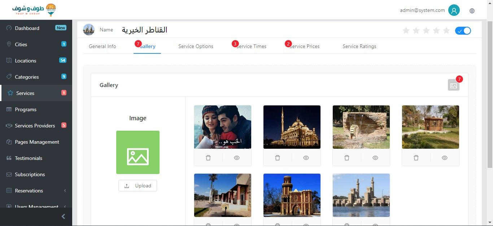
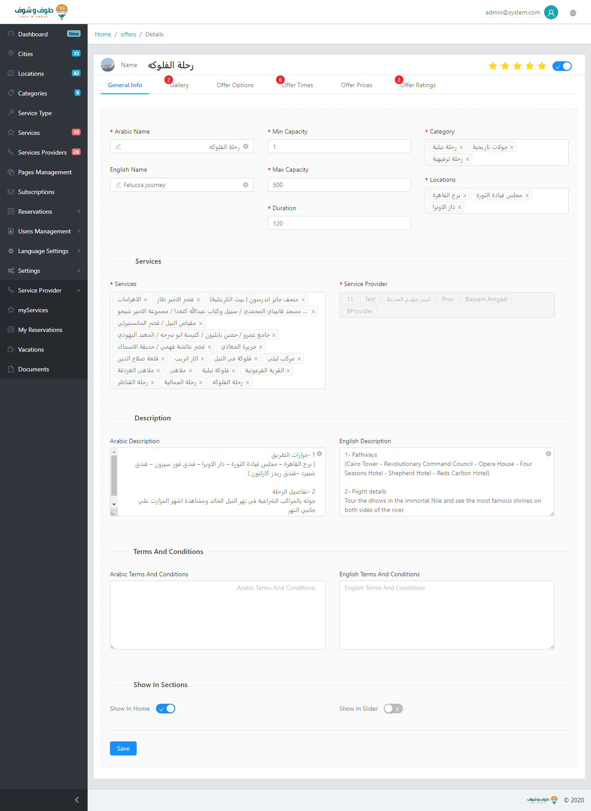

# Maqased (Tour W Shouf / طوف وشوف) — Travel Reservation System

> Admin dashboard for a travel/tourism reservation platform ("Tour W Shouf"). Covers the full catalog-to-booking chain: cities, locations, categories, services, service providers, programs/offers, pricing, scheduling, galleries, ratings, reservations, subscriptions, and users. Bilingual Arabic/English with RTL/LTR layouts.

## What it does

- **Catalog hierarchy**: Cities (13) → Locations (82) → Services (19) → Offers/Programs, with Categories (9), Service Types, and Service Providers (24).
- **Service detail** ("القناطر الخيرية"): tabs for General Info, Gallery (7), Options, Times (3), Prices (2), Ratings; price table with visitor type, group-size bands, sell/discount/cost, date ranges, edit/delete, Add/Export/pagination.
- **Offer detail** ("رحلة الفلوكة / Felucca Journey"): bilingual names, capacity 1–500, duration, categories, locations, ~20-service tag picker, bilingual description and terms, Home/Slider placement toggles.
- **Scheduling & pricing modal**: Single/Group type, guest type, min/max counts, sell/cost + tax fields, from/to dates and hours, Morning/Afternoon/All-Day slots.
- **Gallery**: upload control with per-image preview/delete.
- **Ratings moderation**: review list with per-review Publish toggles and aggregate stars.
- **Roles**: system admin vs. service-provider views (myServices, My Reservations, Vacations, Documents), plus Reservations, Subscriptions, Users, Pages, Language, and Settings modules.

## Frontend developer role

- Built the admin shell: dark sidebar navigation with live counts, breadcrumbs, session header, and tabbed detail layouts — in both Arabic (RTL) and English (LTR).
- Implemented data-dense tables (prices, schedules, ratings) with sorting affordances, pagination, row actions, and add/export controls.
- Built complex bilingual forms: validated required fields, tag-style multi-selects (categories, locations, services), capacity/duration numerics, and terms blocks.
- Implemented the scheduling/pricing modal: grouped sections (service, guest, prices, dates, time-of-day) with toggles, radios, dropdowns, and date/time pickers.
- Built gallery management UI (upload, grid, preview, delete with badge counts) and ratings moderation (publish gating per review).
- Handled bilingual content display, RTL mirroring, and dashboard usability under real catalog scale (80+ locations, 20+ providers).

## Tech signals

- React component architecture with antd.

## Screenshots

.png)
.png)
